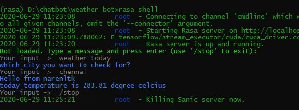

<p align="center">
  
</p>

# Rasa_narenltk_weather_bot

This is a weather api Bot, which actually uses the  following link for [API](https://openweathermap.org/)

Here the Tensorflow latest version is what I have used. I have removed that in the requirements txt file, so if your searching for it you won't find it.

### If you need any help with installing Rasa, then click here... [Link](https://medium.com/@narenltk/rasa-chat-bot-installation-on-windows-10-21b4e8f16f5c)

Before using this repo make sure to enable the virtual environment, so that you wouldn't mess with your other projects. 

If in any case you wanna know how to create Virtual Environment, have a look into the blog here [Link](https://medium.com/@narenltk/why-do-we-need-a-virtual-environment-ec5f4cbb9dc0)

Now follow the steps given below:
1. Open up your Virtual Environment
2. Git clone this repo

```
git clone https://github.com/narenltk/Rasa_narenltk_weather_bot.git 
```

3. Now change directory to the folder in which you have cloned this repo.
4. From now on it is simple, just run the following commands

```
rasa train
```

5. Once this is done, you're supposed to run the actions.py file in another seperate terminal,

```
rasa run actions
```

6. If there aren't any bugs in then you can enter to the place where your can communicate with the bot
7. Go to the terminal where you have executed the rasa train and run the following command,

```
rasa shell
``` 

or if your using rasa x then 

```
rasa x
```

8. Well you have reached this far, so you can now enter your enter the state you want

Output:

<p align="center">
  
</p>


9. If your connecting your rasa chatbot with webpage then you the following command,

```
rasa run -m models --enable-api --cors "*" --debug
```
